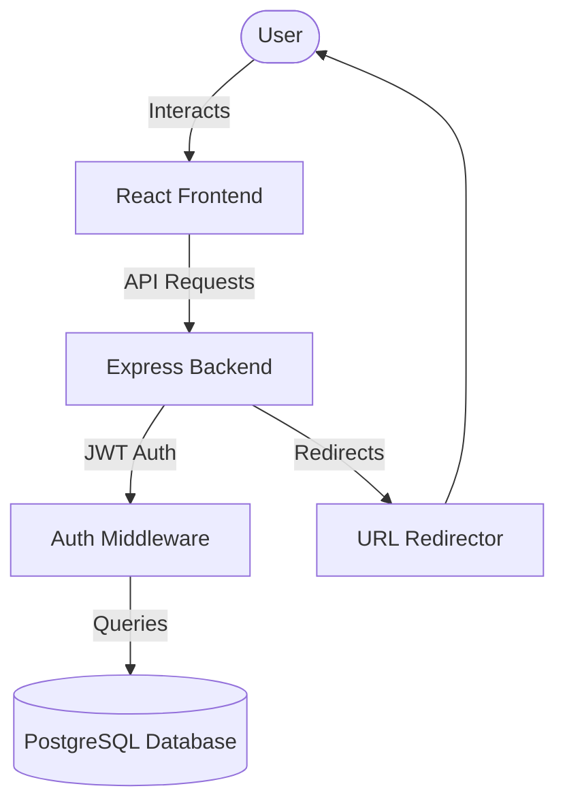

# Project Planning & Features - Shortify

## 1. Planning the App

The goal of Shortify is to provide a robust, self-hosted URL shortening service with advanced features like analytics, bulk uploads, and QR code generation. The planning phase focused on creating a modular architecture that separates the frontend (React) from the backend (Express) to ensure scalability and ease of maintenance.

### Key Planning Considerations:
- **Security**: Implementing JWT for stateless authentication.
- **Performance**: Efficient URL redirection and visit logging.
- **User Experience**: A clean, dark-themed dashboard for managing links.
- **Scalability**: PostgreSQL for reliable data storage.

## 2. Features Documentation

Shortify is packed with features designed for both individual and power users.

### User Authentication
- **Signup/Login**: Secure user registration and authentication using `bcryptjs` for password hashing.
- **Profile Management**: Users can view and manage their account details.

### URL Shortening & Management
- **Basic Shortening**: Convert long URLs into concise, shareable links.
- **Custom Aliases**: Users can specify their own short codes (e.g., `shortify.com/r/my-link`).
- **Expiry Dates**: Set optional expiration dates for links to automatically disable them.
- **Link Management**: Toggle links active/inactive or delete them entirely.

### Analytics & Tracking
- **Click Counting**: Real-time tracking of how many times a link has been clicked.
- **Visit History**: Detailed logs of when links were accessed.
- **Dashboard Overview**: A centralized view of all created links and their performance.

### Advanced Tools
- **QR Code Generation**: Automatically generate QR codes for every shortened URL for easy offline sharing.
- **Bulk Upload**: Upload a CSV file to shorten multiple URLs at once.

## 3. AI Planning Document & Architecture

This section documents the technical design and the logical steps taken during the application's development.

### Architecture Diagram

### Technical Stack
- **Frontend**: React 19, Vite, Tailwind CSS, Recharts (for analytics).
- **Backend**: Node.js, Express.js.
- **Database**: PostgreSQL with `pg` driver.
- **Authentication**: JSON Web Tokens (JWT).

## 4. Assumptions Made

- **Environment**: The application assumes a Node.js environment and a running PostgreSQL instance.
- **Data Persistence**: URLs and click data are stored permanently unless deleted by the user.
- **Authentication**: JWTs are used for all protected routes, assuming the client stores them securely.
- **Browser Support**: Targeted for modern evergreen browsers.
