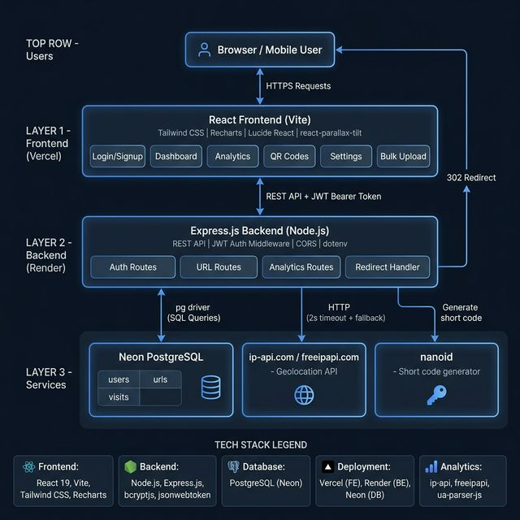

# Shortify — Smart URL Shortener

A powerful, full-stack URL Shortener application with advanced analytics, QR code generation, geolocation tracking, and bulk upload capabilities. Built with a focus on speed, security, and user experience.

---

## Demo Video

Watch the Loom Demo: https://www.loom.com/share/2ceed03e428444fdbc62473239873609

---

## Architecture Diagram



---


## Features
The application provides a comprehensive set of features focused on usability, analytics, and scalability:

### Core Features
- **User Authentication** — Secure signup and login with JWT-based session management  
- **URL Shortening** — Generates unique short links instantly using nanoid  
- **Redirect System** — Fast server-side redirection via `/r/:short_code`  
- **Click Analytics** — Tracks total clicks and maintains visit history  
- **Expiry Dates** — Allows links to expire automatically based on datetime  

### Bonus Features
- **Custom Alias** — Users can define their own short codes (e.g., `/r/my-link`)  
- **QR Code Generation** — Generates downloadable QR codes for each shortened URL  
- **Daily Click Trends** — Visualizes clicks over time using line charts  
- **Bulk CSV Upload** — Enables creation of multiple short URLs through CSV upload  
- **Edit Links** — Allows updating of original URL and expiry date
- **Duplicate URL Prevention** — Prevents creation of duplicate short links for the same URL by reusing existing entries for a user
- **Geolocation Analytics** — Captures visitor country and city for each click  
- **Browser & Device Analytics** — Detects browser type and device (mobile/desktop)  
- **Public Stats Page** — Provides a shareable analytics page for each link  
- **Link Filters** — Filters links by status (active/expired) and sorts by metrics  
- **Expiry Warnings** — Displays alerts when links are about to expire (≤ 3 days)  
- **Change Password** — Allows users to securely update their password  
- **Delete Account** — Enables full account deletion with associated data cleanup-
- **Keep-Alive Service** — cron-job.org configured to ping Render backend every 5 minutes preventing cold start delays

---
## Features
... (core + bonus features)

---

## ✨ UI/UX Highlights
- Pixel cursor for interactive experience  
- 3D tilt cards on analytics dashboard  
- Glassmorphism-based modern UI design  
- Smooth scroll and reveal animations  
- Toast notifications for user feedback  
- Fully responsive across mobile, tablet, and desktop  

---

## Tech Stack

| Layer | Technology |
|-------|-----------|
| Frontend | React (Vite), Tailwind CSS, Recharts, Lucide React |
| Backend | Node.js, Express.js |
| Database | PostgreSQL (Neon hosted) |
| Auth | JWT (Stateless) |
| Deployment | Vercel (Frontend), Render (Backend), Neon (DB) |

---

## Getting Started

### Prerequisites
- Node.js v18+
- PostgreSQL v14+
- npm

### 1. Clone the repository
```bash
git clone https://github.com/YOURUSERNAME/shortify.git
cd shortify
```

### 2. Database Setup
Run the following SQL to create all tables:
```sql
CREATE TABLE users (
    user_id SERIAL PRIMARY KEY,
    name VARCHAR(100),
    email VARCHAR(150) UNIQUE NOT NULL,
    password VARCHAR(255) NOT NULL,
    created_at TIMESTAMP DEFAULT CURRENT_TIMESTAMP,
    last_login TIMESTAMP
);

CREATE TABLE urls (
    url_id SERIAL PRIMARY KEY,
    user_id INTEGER REFERENCES users(user_id),
    original_url TEXT NOT NULL,
    short_code VARCHAR(20) UNIQUE NOT NULL,
    created_at TIMESTAMP DEFAULT CURRENT_TIMESTAMP,
    expiry_date TIMESTAMP NULL,
    click_count INTEGER DEFAULT 0,
    is_active BOOLEAN DEFAULT TRUE,
    qr_generated BOOLEAN DEFAULT FALSE
);

CREATE TABLE visits (
    visit_id SERIAL PRIMARY KEY,
    url_id INTEGER REFERENCES urls(url_id),
    visited_at TIMESTAMP DEFAULT CURRENT_TIMESTAMP,
    country TEXT,
    city TEXT,
    browser TEXT,
    device TEXT
);
```

### 3. Backend Setup
```bash
cd backend
npm install
```

Create .env file:
```
PORT=5000
DATABASE_URL=your_postgresql_connection_string
JWT_SECRET=your_secret_key
FRONTEND_URL=https://shortify-sand.vercel.app
```

Start backend:
```bash
npm run dev
```

### 4. Frontend Setup
```bash
cd frontend
npm install
```

Create .env file:
```
VITE_API_URL=http://localhost:5000/api
```

Start frontend:
```bash
npm run dev
```

---

## Live Demo

| Service | URL |
|---------|-----|
| Frontend | https://shortify-sand.vercel.app |
| Backend API | https://shortify-backend-ch6j.onrender.com |

---

## Assumptions Made

1. Each user cannot create multiple short links for the same URL — existing short link is reused to avoid duplication
2. Short codes are generated using nanoid (7 characters) — collision probability is negligible
3. Click count is incremented on every redirect regardless of unique visits
4. Geolocation is tracked asynchronously — redirect is never delayed for geo lookup
5. QR codes are generated on-demand in the browser — not stored in DB
6. Expired links redirect to a dedicated /expired page instead of returning a 404
7. JWT tokens are stored in localStorage
8. Free tier services are used — Render may have cold start delays of 30-60 seconds after inactivity
9. Browser and device detection is based on user-agent string parsing — may not be 100% accurate for all clients
10. Public stats pages are accessible without authentication — no sensitive data is exposed

---

## AI Planning Document

 [View AI Planning Document](./project_planning_document.pdf)

---

This project is a part of a hackathon run by https://katomaran.com
