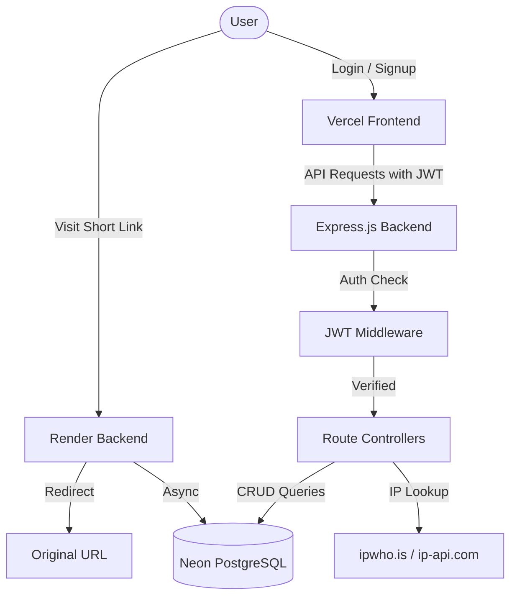

# Shortify — Smart URL Shortener

> This project is a part of a hackathon run by https://katomaran.com

A powerful, full-stack URL Shortener application with advanced analytics, QR code generation, geolocation tracking, and bulk upload capabilities. Built with a focus on speed, security, and user experience.

---

## Demo Video

Watch the Loom Demo: YOUR_LOOM_LINK_HERE

---

## Architecture Diagram


---

## Features

### Core Features
- User Authentication — Signup, Login, JWT-based session management
- URL Shortening — Generate short links instantly with nanoid
- Click Analytics — Track total clicks, visit history, and trends
- Expiry Dates — Set auto-expiring links with datetime support
- Redirects — Fast server-side redirects via /r/:short_code

### Bonus Features
- Custom Alias — Choose your own short code (e.g. /r/my-link)
- QR Code Generation — Generate and download QR codes per link
- Daily Click Trends — Line chart showing clicks over time
- Bulk CSV Upload — Upload multiple URLs at once via CSV file
- Edit Links — Update destination URL and expiry date
- Geolocation Analytics — Track country and city per click
- Browser and Device Analytics — Track Chrome/Firefox/Safari, Mobile/Desktop
- Public Stats Page — Share a public analytics page for any link
- Link Filters — Filter by status (active/expired) and sort by date/clicks
- Expiry Warnings — Visual badge when link expires within 3 days
- Change Password — Secure password update with bcrypt
- Delete Account — Full account deletion with data cleanup

---

## Tech Stack

| Layer | Technology |
|-------|-----------|
| Frontend | React (Vite), Tailwind CSS, Recharts, Lucide React |
| Backend | Node.js, Express.js |
| Database | PostgreSQL (Neon hosted) |
| Auth | JWT (Stateless) |
| Deployment | Vercel (Frontend), Render (Backend), Neon (DB) |

---

## Getting Started

### Prerequisites
- Node.js v18+
- PostgreSQL v14+
- npm

### 1. Clone the repository
```bash
git clone https://github.com/YOURUSERNAME/shortify.git
cd shortify
```

### 2. Database Setup
Run the following SQL to create all tables:
```sql
CREATE TABLE users (
    user_id SERIAL PRIMARY KEY,
    name VARCHAR(100),
    email VARCHAR(150) UNIQUE NOT NULL,
    password VARCHAR(255) NOT NULL,
    created_at TIMESTAMP DEFAULT CURRENT_TIMESTAMP,
    last_login TIMESTAMP
);

CREATE TABLE urls (
    url_id SERIAL PRIMARY KEY,
    user_id INTEGER REFERENCES users(user_id),
    original_url TEXT NOT NULL,
    short_code VARCHAR(20) UNIQUE NOT NULL,
    created_at TIMESTAMP DEFAULT CURRENT_TIMESTAMP,
    expiry_date TIMESTAMP NULL,
    click_count INTEGER DEFAULT 0,
    is_active BOOLEAN DEFAULT TRUE,
    qr_generated BOOLEAN DEFAULT FALSE
);

CREATE TABLE visits (
    visit_id SERIAL PRIMARY KEY,
    url_id INTEGER REFERENCES urls(url_id),
    visited_at TIMESTAMP DEFAULT CURRENT_TIMESTAMP,
    country TEXT,
    city TEXT,
    browser TEXT,
    device TEXT
);
```

### 3. Backend Setup
```bash
cd backend
npm install
```

Create .env file:
```
PORT=5000
DATABASE_URL=your_postgresql_connection_string
JWT_SECRET=your_secret_key
FRONTEND_URL=https://shortify-sand.vercel.app
```

Start backend:
```bash
npm run dev
```

### 4. Frontend Setup
```bash
cd frontend
npm install
```

Create .env file:
```
VITE_API_URL=http://localhost:5000/api
```

Start frontend:
```bash
npm run dev
```

---

## Live Demo

| Service | URL |
|---------|-----|
| Frontend | https://shortify-sand.vercel.app |
| Backend API | https://shortify-backend-ch6j.onrender.com |

---

## Assumptions Made

1. Each user can create multiple short links for the same URL — useful for different expiry dates or aliases
2. Short codes are generated using nanoid (7 characters) — collision probability is negligible
3. Click count is incremented on every redirect regardless of unique visits
4. Geolocation is tracked asynchronously — redirect is never delayed for geo lookup
5. QR codes are generated on-demand in the browser — not stored in DB
6. Expired links redirect to a dedicated /expired page instead of returning a 404
7. JWT tokens are stored in localStorage — suitable for a hackathon context
8. Free tier services are used — Render may have cold start delays of 30-60 seconds after inactivity
9. Browser and device detection is based on user-agent string parsing — may not be 100% accurate for all clients
10. Public stats pages are accessible without authentication — no sensitive data is exposed

---

## AI Planning Document

This application was planned and built using AI-assisted development. The planning process followed these steps:

### Step 1 — Feature Planning
Defined core and bonus features based on the hackathon requirements. Prioritized features by complexity and impact.

### Step 2 — Architecture Design
Designed a 3-tier architecture: React frontend → Express backend → PostgreSQL database. Decided on JWT for stateless authentication.

### Step 3 — Database Schema
Designed 3 tables: users, urls, visits. Added columns incrementally as features were added (geolocation, browser/device tracking, QR tracking).

### Step 4 — API Design
Defined REST API endpoints covering auth, URL management, analytics, and redirects.

### Step 5 — UI Design
Chose a dark glassmorphism theme with #0B1220 background and #4988C4 to #6aa8ff blue gradient accent colors.

### Step 6 — Implementation
Built features incrementally — core first, then bonus features. Each feature was tested before moving to the next.

### Step 7 — Deployment
Deployed backend on Render, frontend on Vercel, database on Neon. Set up cron-job.org to keep Render alive.

---

This project is a part of a hackathon run by https://katomaran.com
