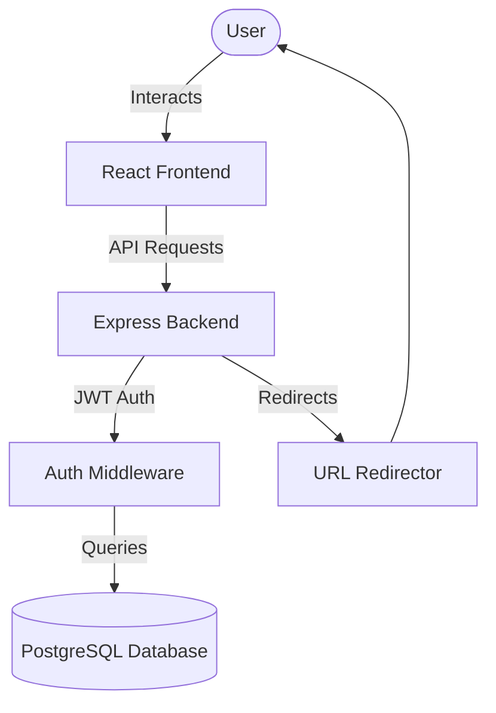

# Shortify

A powerful, full-stack URL Shortener application with advanced analytics, QR code generation, and bulk upload capabilities. Build with a focus on speed, security, and user experience.

## 🏗️ Architecture



For more detailed information on features, planning, and assumptions, see [PLANNING.md](./PLANNING.md).

## 🚀 Getting Started

### Prerequisites
- Node.js (v18+)
- PostgreSQL (v14+)
- npm or yarn

### 1. Database Setup
1. Create a database named `shortify` in PostgreSQL.
2. Run the schema script to initialize the tables:
   ```bash
   psql -d shortify -f backend/schema.sql
   ```

### 2. Backend Configuration
1. Navigate to the backend directory:
   ```bash
   cd backend
   ```
2. Install dependencies:
   ```bash
   npm install
   ```
3. Create a `.env` file from current environment:
   ```bash
   # Use the values from your existing .env or .env.example
   ```
4. Set your environment variables:
   - `DATABASE_URL`: Your PostgreSQL connection string.
   - `JWT_SECRET`: A secure random string for signing tokens.
   - `PORT`: (Optional) Port to run the server on (default: 5000).

5. Start the server:
   ```bash
   npm run dev
   ```

### 3. Frontend Configuration
1. Navigate to the frontend directory:
   ```bash
   cd frontend
   ```
2. Install dependencies:
   ```bash
   npm install
   ```
3. Create a `.env` file:
   ```bash
   echo "VITE_API_URL=http://localhost:5000" > .env
   ```
4. Start the development server:
   ```bash
   npm run dev
   ```

## 🛠️ Tech Stack
- **Frontend**: React (Vite), Tailwind CSS, Framer Motion, Lucide React, Recharts.
- **Backend**: Node.js, Express.js.
- **Database**: PostgreSQL.
- **Authentication**: JWT (Stateless).

## 📑 Documentation
- [PLANNING.md](./PLANNING.md): Features, architecture, and assumptions.
- [backend/README.md](./backend/README.md): Backend-specific details and API endpoints.
- [frontend/README.md](./frontend/README.md): Frontend component overview and styles.

## 🤝 Contributing
Contributions are welcome! Please open an issue or submit a pull request for any improvements.
